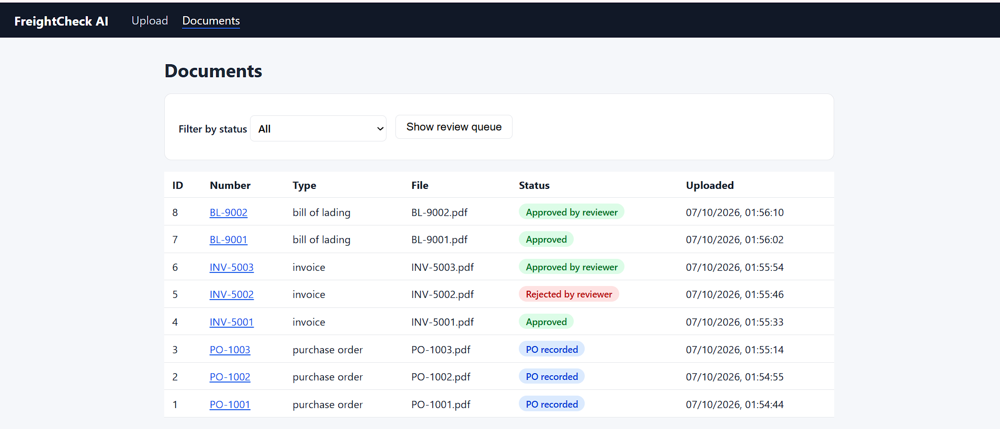
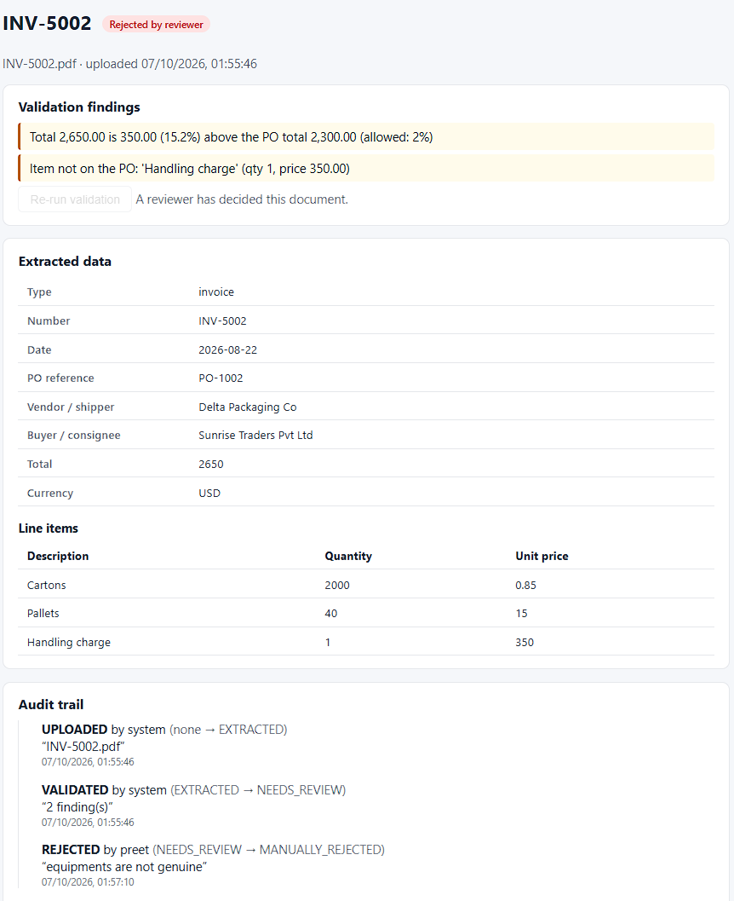
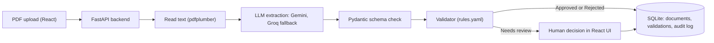

# FreightCheck AI

An AI-assisted document checker for logistics. Upload purchase orders, invoices and bills of lading as PDFs. An LLM reads each one, business rules compare it against its purchase order, and anything suspicious goes to a human reviewer. Every step is recorded in an audit trail.

All sample documents in this repo are fictional.

## Screenshots

| Documents list | Document detail with findings, decision and audit trail |
|---|---|
|  |  |

## What it does

1. **Extracts** structured data (numbers, dates, vendor, line items, totals, ports, container) from PDFs using an LLM, and checks the result against a strict schema.
2. **Validates** each invoice or bill of lading against its purchase order using rules defined in a YAML file.
3. **Decides** automatically when it can: `APPROVED`, `NEEDS_REVIEW` or `REJECTED`, with plain-English reasons.
4. **Routes** doubtful documents to a person, who approves or rejects them with a mandatory comment.
5. **Records** everything in an append-only audit log (who, what, when, and why).

## Architecture



### Statuses

| Status | Meaning |
|---|---|
| `PO_RECORDED` | A purchase order was stored as the reference for later documents |
| `APPROVED` | Every rule passed |
| `NEEDS_REVIEW` | A rule found a problem a person should look at (for example a quantity or total mismatch) |
| `REJECTED` | Hard failure: no PO reference, or a duplicate document number |
| `MANUALLY_APPROVED` / `MANUALLY_REJECTED` | A reviewer decided, with a comment |

## Design decisions

- **Business rules live in `backend/rules.yaml`, not in code.** The file chooses which checks run for each document type, their severity and numbers such as the 2% total tolerance. Changing a rule needs no code change. The checks themselves are small generic functions in `validator.py`.
- **LLM output is never trusted blindly.** Responses are parsed into a Pydantic schema, and the prompt tells the model to use `null` rather than guess.
- **Two LLM providers.** Gemini is tried first and Groq takes over when Gemini fails (for example when the free-tier quota is used up). Temporary overloads (503) are retried; quota errors are not.
- **Humans stay in control.** Only `NEEDS_REVIEW` documents can be decided, a reason is mandatory, a decision cannot be overwritten by re-validation, and automatic rejections cannot be overridden.
- **Audit trail by design.** Every upload, validation run and decision is stored with actor, comment and before/after status.
- **Tests do not need an LLM.** The test suite uses already-extracted data, so it is fast and uses no API quota.

## Tech stack

| Layer | Tools |
|---|---|
| Frontend | React, Vite, React Router |
| Backend | Python, FastAPI, Pydantic |
| AI | Google Gemini (primary), Groq (fallback) |
| Documents | pdfplumber, ReportLab (to generate sample PDFs) |
| Data | SQLite |
| Config | YAML |
| Testing | pytest |

## Getting started

You need Python 3.12 or newer and Node.js (LTS).

### 1. Backend

```bash
python -m venv venv
venv\Scripts\activate            # Windows
# source venv/bin/activate       # macOS / Linux
pip install -r requirements.txt
```

Create a file named `.env` in the project root (never commit it):

```
GEMINI_API_KEY=your_gemini_key
GEMINI_MODEL=gemini-3.8-flash
GROQ_API_KEY=your_groq_key
GROQ_MODEL=openai/gpt-oss-120b
```

Free API keys: [Google AI Studio](https://aistudio.google.com) and [Groq Console](https://console.groq.com). Model names change over time, so check each provider's current model list if you get a "model not found" error. Free tiers have daily limits.

Generate the sample documents and start the API:

```bash
python scripts/generate_samples.py
uvicorn backend.main:app --reload
```

API docs: http://127.0.0.1:8000/docs

### 2. Frontend

In a second terminal:

```bash
cd frontend
npm install
npm run dev
```

Open http://localhost:5173

### 3. Try it

Upload the files from `samples/` **once each, purchase orders first**, then open the review queue.

| File | Expected result |
|---|---|
| PO-1001, PO-1002, PO-1003 | `PO_RECORDED` |
| INV-5001, BL-9001 | `APPROVED` |
| INV-5002 | `NEEDS_REVIEW`: extra 350 USD handling charge |
| INV-5003 | `NEEDS_REVIEW`: 15000 resistors invoiced vs 20000 ordered |
| BL-9002 | `NEEDS_REVIEW`: 38 pallets shipped vs 40 ordered |

Uploading the same document twice is rejected as a duplicate. To re-check a document without uploading it again, use `POST /documents/{id}/validate`.

## API

| Method | Endpoint | Purpose |
|---|---|---|
| POST | `/documents/upload` | Upload a PDF; extracts, validates and stores it |
| GET | `/documents` | List documents (`?status=NEEDS_REVIEW` for the review queue) |
| GET | `/documents/{id}` | Extracted data and latest validation result |
| POST | `/documents/{id}/validate` | Re-run validation (for example after the PO arrives) |
| POST | `/documents/{id}/decision` | Reviewer approves or rejects (name and comment required) |
| GET | `/documents/{id}/audit` | Full audit trail for a document |

## Tests

```bash
pytest -v
```

30 tests cover the five sample outcomes, edge cases (missing PO, duplicates, tolerance limits, vendor name formatting, wrong prices and dates), the decision rules and the audit trail.

## Project structure

```
backend/      FastAPI app, extractor, validator, rules.yaml
frontend/     React app (upload, document list, detail and decision pages)
samples/      Generated fake documents
scripts/      Sample PDF generator
tests/        Validator and decision tests
```

## Limitations and next steps

- No login: the reviewer types their name. A real system would use authenticated users and roles.
- Text-based PDFs only. Scanned images would need OCR.
- SQLite and local file storage suit a demo, not production.
- Currency conversion and shipping-route checks are not implemented yet.
- Not deployed yet.
